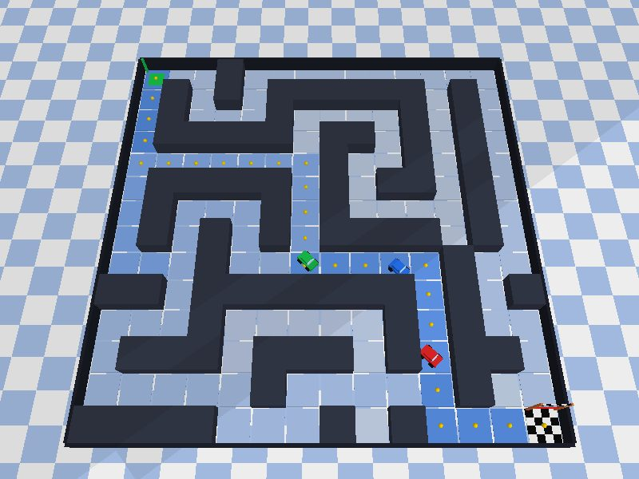
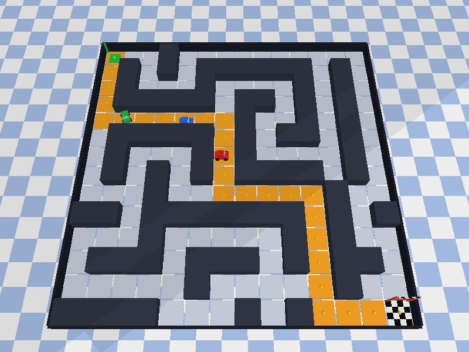

# Enjambre de 3 carritos con algoritmo de hormigas (ACO) en ESP32 y gemelo digital en PyBullet

Tres ESP32 buscan la ruta óptima desde un punto **A** hasta la **meta** en un laberinto/almacén.
Cada ESP32 ejecuta su propia colonia de hormigas, comparte feromonas por WiFi con los otros
dos, y una simulación PyBullet (en Docker) replica en 3D lo que hace cada carrito.

| Exploración (≈ 9 s) | Convergencia (≈ 35 s) |
|---|---|
|  |  |

Piso: intensidad de feromona (gris → azul → naranja → rojo). Esferas doradas: mejor ruta del enjambre.
Carritos: rojo = 1, azul = 2, verde = 3.

---

## 1. Arquitectura

```
 MUNDO FÍSICO                 PARTE DE RED                     PARTE VIRTUAL (Docker)
┌──────────────┐          ┌───────────────────┐           ┌──────────────────────────┐
│ ESP32 #2     │──UDP────▶│ ESP32 #1          │──UDP─────▶│ simulacion.py            │
│  ACO local   │◀─────────│  MODO AP          │           │  PyBullet: laberinto,    │
├──────────────┤          │  SSID ACO_SWARM   │           │  meta y 3 carros         │
│ ESP32 #3     │──UDP────▶│  192.168.4.1:4210 │           │  visor web :8080         │
│  ACO local   │◀─────────│  + ACO local      │           └──────────────────────────┘
└──────────────┘          │  + relevo de msgs │
                          └───────────────────┘
```

- **Carrito 1** crea la red WiFi `ACO_SWARM` (modo AP), corre su ACO y **reenvía** cada mensaje
  a todos los demás nodos registrados (carritos 2, 3 y el PC).
- **Carritos 2 y 3** se conectan a esa red, corren su ACO y mandan sus mensajes al carrito 1.
- **El PC** se conecta a la misma red WiFi; la simulación se registra ante el carrito 1 y recibe todo.

### Protocolo UDP (texto plano, puerto 4210)

| Mensaje | Formato | Quién lo envía |
|---|---|---|
| Registro | `HELLO,<id>` (id 0 = PC) | carritos 2, 3 y PC, cada 2 s |
| Depósito de feromona | `DEP,<id>,<iter>,<pasos>,<c0>-<c1>-...-<cn>` | cada carrito, una vez por iteración |
| Estado | `ST,<id>,<iter>,<celda>,<mejor>,<convergido>,<origen>` | cada carrito, cada 350 ms |
| Mapa de feromonas | `PH,1,<2 hex por celda>` | solo el carrito 1, cada 1 s |

Las celdas se numeran `fila * COLUMNAS + columna` (0 = esquina superior izquierda).

---

## 2. El algoritmo (MAX-MIN Ant System distribuido)

Cada ESP32, cada 800 ms:

1. **Evapora** la feromona: `τ ← τ·(1 − ρ)`, sin bajar de `τ_min`.
2. Lanza **4 hormigas** desde A. En cada celda la hormiga elige vecino con probabilidad
   `p ∝ τ^α · η^β`, donde `η = 1 / (1 + distancia Manhattan a la meta)`.
   Usa **lista tabú** (no repite celdas) y **retrocede** si cae en un callejón sin salida.
3. Cada hormiga deja un rastro local `Q_hormiga / longitud`.
4. La **mejor hormiga de la iteración** deposita `Q / longitud` y ese depósito se **envía por red**.
5. Al recibir un `DEP` de otro carrito, lo suma a su propia matriz (estigmergia compartida)
   y, si la ruta es más corta que la suya, la adopta como mejor ruta.
6. Tras 25 iteraciones sin mejorar se declara **convergido** (LED azul fijo).

En paralelo, cada carrito "conduce" virtualmente su mejor ruta, una celda cada 350 ms, y
reporta la celda en la que va. Al llegar a la meta, vuelve a A con la mejor ruta del momento.

Parámetros en `firmware/aco_carrito/config.h` (y los mismos en `simulacion/aco_core.py`):

| Parámetro | Valor | Efecto |
|---|---|---|
| `N_ANTS` | 4 | hormigas por iteración en cada ESP32 |
| `ALPHA` | 1.0 | peso de la feromona |
| `BETA` | 1.0 | peso de la heurística |
| `RHO` | 0.10 | evaporación |
| `Q_HORMIGA` / `Q_DEPOSITO` | 1 / 5 | rastro de cada hormiga / refuerzo de la mejor |
| `TAU_MIN` / `TAU_MAX` | 0.05 / 10 | límites MMAS (evitan estancamiento) |

**Laberinto incluido:** 14×14, A en (0,0), meta en (13,13). Ruta óptima: **26 pasos**.
Las primeras rutas que encuentra el enjambre suelen ser de 28–32 pasos.

---

## 3. Hardware

- 3 × ESP32 DevKit (ESP32-WROOM-32), cable USB de datos.
- El LED azul de la placa (GPIO 2) parpadea al recibir feromona de otro carrito y queda fijo al converger.
- Ninguna conexión extra: en esta versión los carritos son nodos de cómputo; el movimiento se ve en el gemelo digital.

---

## 4. Cargar el firmware

1. Arduino IDE 2.x → *Archivo → Preferencias → URLs adicionales*:
   `https://espressif.github.io/arduino-esp32/package_esp32_index.json`
2. *Gestor de tarjetas* → instala **esp32 by Espressif Systems** (2.x o 3.x sirven).
3. Abre `firmware/aco_carrito/aco_carrito.ino`. Placa: **ESP32 Dev Module**.
4. En `config.h` cambia **solo** `CAR_ID` y carga cada placa:
   - Placa 1 → `#define CAR_ID 1` (esta es la que crea la red, enciéndela primero)
   - Placa 2 → `#define CAR_ID 2`
   - Placa 3 → `#define CAR_ID 3`
5. Monitor serie a **115200**. En el carrito 1 debes ver `AP 'ACO_SWARM' creado` y luego
   `Nodo registrado` por cada carrito que se une.

---

## 5. Correr el gemelo digital

### Opción A — Docker (recomendado)

1. Conecta el PC a la red WiFi **ACO_SWARM** (clave `hormigas123`).
2. En la carpeta del proyecto:
   ```bash
   docker compose --profile real up --build
   ```
3. Abre **http://localhost:8080**.

### Opción B — sin hardware (emulador de los 3 ESP32)

Para probar o presentar sin las placas. El emulador habla exactamente el mismo protocolo que el carrito 1:
```bash
docker compose --profile demo up --build
```
y abre **http://localhost:8080**.

### Opción C — sin Docker, con ventana 3D nativa de PyBullet

Requiere **Python 3.11** (PyBullet no tiene wheel para 3.13 en todas las plataformas).
```bash
cd simulacion
pip install -r requirements.txt
python simulacion.py --modo gui                       # con los ESP32
# o, sin hardware, en dos terminales:
python emulador_esp32.py --puerto 4211
python simulacion.py --modo gui --ap 127.0.0.1 --ap-puerto 4211
```

---

## 6. Cambiar el laberinto

El mapa vive en un solo lugar: `simulacion/laberinto.py` (`S` = A, `G` = meta, `#` = pared).
Después de editarlo, regenera el archivo del firmware y vuelve a cargar las 3 placas:
```bash
cd simulacion
python laberinto.py --exportar-h ../firmware/aco_carrito/maze.h
```
Límite práctico: unas 250 celdas (para que un `DEP` quepa en un paquete UDP).

---

## 7. Problemas frecuentes

| Síntoma | Causa probable / solución |
|---|---|
| El visor dice "esperando a los ESP32…" | El PC no está conectado a `ACO_SWARM`, o el carrito 1 está apagado. |
| En Windows no llega nada | El Firewall bloquea UDP 4210: permite Python/Docker en redes **públicas** (la red del ESP32 se marca pública). |
| El carrito 2 o 3 no aparece | Mira su monitor serie: si no dice `IP 192.168.4.x`, revisa SSID/clave en `config.h`. |
| Error al compilar `WiFi.h` | Falta el core ESP32 o está seleccionada otra placa. |
| `pip` falla instalando pybullet | Usa Python 3.11, o Docker. |

---
